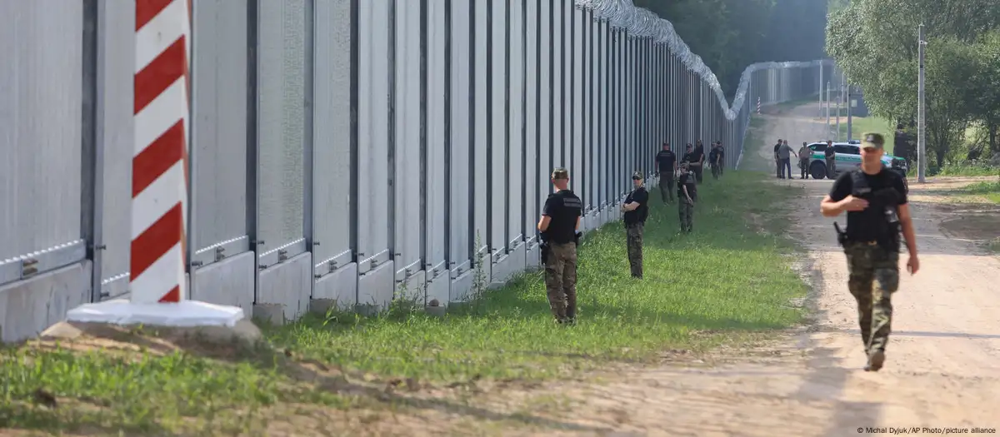
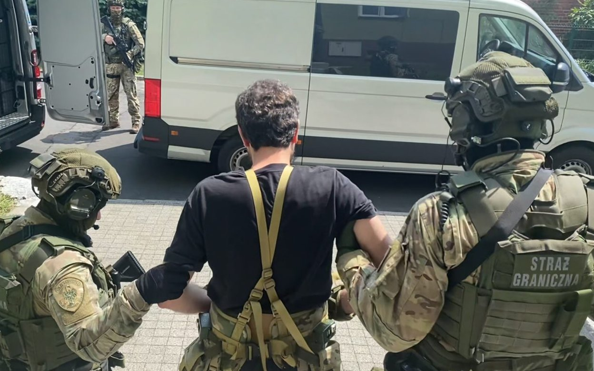
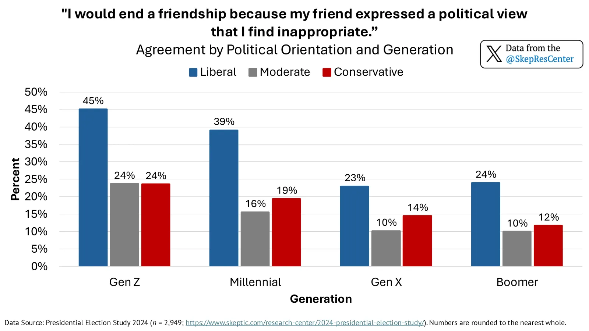

(Image: Polish-Belarusian border amidst Russia-orchestrated hybrid warfare; source: [dw.com](https://www.dw.com/en/poland-strengthens-belarus-border-after-wagner-chief-arrival/a-66094722))

## Intro

The asylum system in Europe is fundamentally broken and unsustainable.

With the number of asylum seekers increasing year by year, the strain on resources and infrastructure is becoming increasingly apparent.

And it's only going to get worse, because what once was a "non-binding agreement" is now being turned into coercion via legal and fiscal means, while those who speak up against it are being silenced and marginalized.

Depending on your political stance, this post might be either illuminating or uncomfortable. I can assure you that **at no point** will I mock your beliefs or opinions - the system is my target, not you.

But you have to try and keep up - this is a long and dense read, necessary for making a coherent and compelling argument that does not descend into any conspiracy theories. It might *sound like one*, but I promise you *it's not* - no secret societies, no Illuminati, no hidden agendas. Just average human beings, each one with their own beliefs, biases, and motivations - all interacting in a complex system that produces unintended consequences, because of a fundamental flaw in its design.

This is my attempt at untangling that mess, with the hope - however dim - of finding a way out that doesn't end up in a civil war or a totalitarian regime.

Fatalistic? Perhaps. But let me tell you the whole story first.

## Background

### Current State of Affairs

As it's typical for the European Union, the legal framework behind the asylum system is extremely complex and convoluted.

In 2020, the **ECHR** (European Court of Human Rights) has published a [Handbook on European law relating to asylum, borders and immigration](https://www.echr.coe.int/documents/d/echr/handbook_asylum_eng).

It has 366 pages. The handbook, not the law itself.

Since my position on this issue is quite clear, I won't go into the details like *"who is eligible for asylum"*, *"what are the rights of asylum seekers"*, etc. Instead, I'm going to show you why the system, as a whole, is a huge mess, an accessible loophole for anyone who wants to abuse it, and a giant problem for the host countries and their citizens.

This is widely recognized, but rarely discussed in public. Nobody wants to be called a racist or fascist, right? *Too bad I don't give a shit* about such pathetic attempts at silencing dissent - and I'm going to show you why you shouldn't either.

My goal is not to turn you into a radical, but into **an auditor**. Deliberate subversion and defiance - *strictly intellectual*, mind you - allows one to **see the flaws** in the system more clearly. And that's an extremely valuable skill to have.

Consider what I tell you *a thought experiment*, a mere *"what if"*, and then **decide for yourself** whether its implications align with your lived experience. So - if you're comfortable with not giving a shit about labels for a moment - let's continue.

While the asylum system is clearly broken, the response from those in power has been to double down on the same failed policies, instead of proposing a real alternative. How so?

### A Naive Belief

I know why the Western elites cling to the asylum system so desperately.

They believe that **every human, if given the opportunity and resources, would ultimately accept the values and norms of liberal democracy and adapt to the Western way of life**.

This belief is unnamed, but usually attributed to the concept of **liberal universalism**, which has - as I will continue to argue throughout this post - little to do with **actual liberalism**, which is *NOT* the target of my critique.

**Liberal universalism** is more *philosophical* than *political*: it suggests that liberal democratic values are not just Western ideals, but **universal truths** that should be embraced by all.

Calling it an **ideology** would be an understatement. This feels like a **religious belief**, where the tenets are accepted without question.

I'd like you to take a look at the paper [Liberal universalism in crisis: The nationalist populist challenge of transnational political standards (Kuhn 2018)](https://sci-hub.se/https://www.tandfonline.com/doi/abs/10.1080/21931674.2018.1505590). It offers an interesting insight into the mind of one of the preachers.

From the very first sentence, it is very obvious that the author is ideologically-driven and is trying to push a specific agenda:

> The explanation of the right-wing populist attack on transnational standards of pluralism and cooperation as caused by unsolved problems of the economic structure is often disputed by regarding populism a “cultural backlash” supported by groups now deprived of their former predominant position by new universalist standards.

We already know who the "good" and "bad" guys are. That's nice, we wouldn't want to waste our energy on thinking too much, would we?

But why does he view it as an "all or nothing" situation? That's because liberal universalism is not just a political stance, but a **moral imperative**. Any incompatibility with their ideals is presented as a "crisis" to overcome:

> Liberal ideology with its values of freedom and diversity is a semantics accompanying the enforcement and maintenance of social differentiation (Walzer, 1984), above all for the individual’s release from prescribed social roles. As long as pluralization processes of social structure continue successfully, the “liberal” program is confirmed. Crises of differentiation and phases of its consolidation are therefore phases of the weakness of liberal ideology.

I know, it's *a little* hard to parse. This is how they present their ideas to each other, in a way that neatly compartmentalizes and validates their worldview, while remaining extremely vague and making it inaccessible to outsiders. Just stay with me, and you'll see how it all fits together.

In a brilliant logical leap, the author even justifies the idea of **sacrificing individual freedoms** and the **democratic rule (!)** in the name of vaguely described "pluralism":

> Its recommendation to instigate pluralism in the name of “freedom” relates negatively to the political system of the organization of collectively binding decisions. The core of classical liberalism is the argument for effective defense against those (political) decisions, especially in the economic sphere, but also for mass media, private behavior, science etc. Liberal social theory stresses the social and political benefits of binding the sovereign legally and of installing spheres of freedom from political intervention or regulation. It describes purely democratic rule as being short-sited.

So *"binding the sovereign legally"* is alleged to have *"social and political benefits"* that will somehow lead to *"freedom from political intervention or regulation"*? And this is supposed to be a scholarly article, from somebody who believes in the moral superiority of their own ideology?

It really sucks when people can't admit that they are wrong, even when the **blatant lack of epistemic rigor** is staring them in the face. What happens then? Well, our benevolent universalists suddenly become very pragmatic and start looking for ways to enforce their beliefs on others, by any means necessary.

### A Political Weapon

Their naivete is reflected at various levels, not only academically.

I have found a very interesting document from the **UNHCR** (United Nations High Commissioner for Refugees) - a [Resettlement Handbook](https://www.unhcr.org/resettlement-handbook/), which is a guide for governments and NGOs on how to resettle refugees and manage the whole process.

I have also stumbled upon the [2011 version of the handbook](https://www.refworld.org/policy/opguidance/unhcr/2011/en/97558), and it's really curious to see how much the language and tone have changed over the years.

The 2011 version comes from a time when the UN was under very little external scrutiny. As a result, it is much more pragmatic and blunt. It uses very utilitarian, rather than moralistic, language. There's no hedging, no "moral duty", etc.

What's there instead is a very clear and direct message: **the asylum system is a political tool, and it should be used as such**:

> 2.2 ENHANCING THE USE OF RESETTLEMENT
>
> 2.2.1 Strategic use of resettlement
>
> [...]
>
> UNHCR’s 2010 Position Paper on the Strategic Use of Resettlement emphasized that these specific protection results could be designed in a way to progressively achieve larger strategic impacts over time. Strategic planning includes clear illustration of incremental protection dividends expected from diverse resettlement contributions over a period of time, in order to maximize concerted efforts by various stakeholders.
>
> [...]
>
> Improved and equitable access to resettlement can also impact the regional context, including: reducing push-pull factors leading to secondary movements, trafficking and smuggling; strengthening regional cooperation and migration management through responsibility sharing; and generally encouraging interest in strengthening refugee protection and developing resettlement programmes.
>
> Strategic use of resettlement can also strengthen the protection benefits accruing to resettlement countries. These include: expanding the range and quality of services available to asylum-seekers; fostering positive attitudes towards refugees and reducing xenophobia, and enriching the cultural and socio-economic diversity within communities.

As you can see, the instrumentalization of refugees is not only happening on the Polish-Belarusian border, but... everywhere, apparently - in the name of an agenda that has nothing to do with helping people in need.

What happens after the resettlement? While they don't say it directly, we can find other sources that - while hilariously anti-multicultural - paint a very distressing picture.

UNHCR has a page dedicated to [gender-based violence](https://www.unhcr.org/gbv-toolkit/resource/safe-disclosure-facilitation-package/). There, in the first document on the list of resources, titled "Discussion: Myths about GBV", we can find:

> Culture needs to be always respected even if it is harmful for girls and women.
>
> FALSE: Harmful practices such as child marriage and female genital mutilation (FGM) cause negative impact to the survivor, family and community. These harmful practices need to be addressed even if it is a part of the culture of the society. Many aspects of culture are highly contested within the culture itself and cultural consensus should not be assumed; some segments of society may be keen to change a cultural practice while others, particularly those who benefit from it, may fight to maintain it. Moreover, inequality of women and girls in itself is deeply rooted in a society’s notions of how women and men “should be” and “should behave”. These “gender norms” are influenced by history, tradition, culture and religion, all of which change over time.

So, culture is to be respected, except when it's harmful - then it must be changed. And they apparently believe that these changes can be done *ad hoc*, without any long-term consequences, and in spite of any opposition.

How this is to be achieved, they don't say. But can we even trust their perception of what's harmful and what's not? Beyond these glaringly horrific practices listed, how can they recognize acts and ideas that go beyond simplistic moral binaries? And can they be trusted to apply these standards consistently across different cultures and contexts?

Given what we've seen so far - they seem to be hyperfixated on the shortcomings of the native population, never on the migrants, who are assumed to be blank slates, ready to be molded into the desired shape. If only those damn "racists" would finally give them a break, and stopped judging them by their actions...

Who's going to tell them about religious fundamentalism? About those who [openly call for the destruction of Western civilization](https://www.spectator.co.uk/article/france-expels-islamists-while-britain-appeases-them/)? About the [radicalized youth](https://www.diis.dk/en/research/europes-teenage-jihadists)?

And if they think they can just erase whatever they see as a threat - well, [history would like a word](https://en.wikipedia.org/wiki/Germanisation_of_Poles_during_the_Partitions). Unfortunately, accounting for such empirical evidence would require them to recognize that hate is sometimes justified, rather than just an irrational expression of one's inherent bias - and it's something they can't afford.

I hope you aren't as naive and realize that cultures are not universally compatible with each other, nor perfectly assimmilable, because it's the only premise that carries the whole system. Without this assumption, there are no other grounds for asylum to be applied as universally and internationally as it is, as we can't be sure of the intentions of whole groups of asylum seekers.

### A Hydra

Every group involved reinforces the other:

1. Academics publish papers advocating for open borders and multiculturalism.
2. NGOs lobby for more funding and more permissive policies.
3. Bureaucrats draft laws shaped by those papers.
4. Politicians sign them to avoid being branded racist.
5. Activists shield against any criticism, and facilitate contact between illegal migrants and NGOs.
6. Human traffickers exploit the situation.
7. Ideologically-aligned judges legitimize trafficking and block deportations.
8. Media defend the system as moral and inevitable.

Anyone trying to dissent is framed as a danger to "liberal democracy", regardless of how pragmatic or factual their position is.

Don't let them argue on their own terms. Reject the framing that paints any opposition as "illiberal", as they like to call it.

Liberalism can exist just fine outside of their delusions. And, of course, there's nothing inherently wrong with nationalism. Both are, in fact, necessary for a healthy society that can find compromise and adapt to everchanging geopolitical landscape.

And, even though I spend so much time on validating this duality - I refuse to pick a side. First and foremost, I consider myself to be an anti-ideologue, and my motivation is to seek truth and understanding, rather than blindly follow any dogma. While I think this is a very reasonable stance, for the universalists it's unforgivable heresy - which baffles me the more I think about it.

## Problems

### Borders Like a Sieve

Possibly the most absurd claim I've ever heard in regards to borders is that ["walls don't stop migration"](https://www.socialeurope.eu/border-walls-dont-stop-migration).

This is, of course, complete nonsense. Walls and fences are not perfect, but they do work. They make it harder for people to cross, and they deter many from even trying:

- Hungary’s fence, completed in late 2015, was highly effective at reducing crossings at its specific border points, dropping from 441,515 in 2015 to under 20,000 by 2017.
- Poland’s border wall, completed in 2022, reduced irregular crossings from a peak of ~40,000 attempts in 2021 to ~26,000 in 2023 and an estimated 14,000–20,000 in 2024.

These numbers could be even lower, if illegal crossing were not **actively encouraged**, as they are in the paper [Refugee Mobilization in the Nepal–India Borderlands: Porosity as Opportunity (Banki 2023)](https://academic.oup.com/jrs/article/38/2/297/7238803):

> Key to the undertaking of these activities was the border’s porosity, which, I argue, is an overlooked opportunity structure in homeland activism. In this article, I draw on borderland theories and empirical evidence from homeland activism carried out by Bhutan’s refugees to elucidate the ways that porosity and opportunity intersect.

The 2011 Resettlement Handbook advocates for **open borders** directly:

> Resettlement has also brought about positive results that go well beyond those that are usually viewed as a resettlement outcome. In the face of a continued influx of refugees, the use of resettlement has convinced countries of first asylum to keep open their borders [...] Overall, resettlement is a dynamic and flexible tool, and when done effectively and with strategic vision, the results of resettlement can be powerful beyond the direct impact on the persons resettled.

Was it the use of resettlement that convinced countries to keep their borders open? Or was it the political pressure from the UN and the EU? So goddamn disingenuous.

(Image: Proper treatment of human traffickers, as demonstrated by the Polish Border Guard; source: [rp.pl](https://www.rp.pl/przestepczosc/art40846691-grupa-przestepcza-rozbita-pieniadze-z-migracji-plynely-do-grup-terrorystycznych))

### Safety For Me But Not For Thee

*Who are those people coming in en masse?* --- We don't know.

*Should we be worried?* --- Not according to the EU and ECHR.

However, the 2011 UNHCR Resettlement Handbook explicitly states that some refugees can be violent and dangerous. And it isn't even trying to present it as a "rare exception".

This is what they say when they think nobody's watching:

> 4.6.2 Security recommendations when conducting interviews
>
> Hostile acts against persons conducting interviews sometimes occur. Given the tension factors outlined above, undertaking resettlement responsibilities adds urgency to the maintenance of appropriate safety standards.
>
> [...]
>
> The following general recommendations are meant to enhance the safety of UNHCR and partner staff involved in the interview process:
>
> - all interviews should, where possible, be by prior appointment;
> - separate procedures should be in place to deal with emergency, urgent or sensitive cases;
> - trained guards should control access to the building and the main entrance to the interview area. If deemed necessary, the guards should carry out searches of individuals seeking access to the building or use a metal detector;
> - the interview area should not be exposed visually to the waiting room;
> - only a limited number of people should be allowed into the waiting area at any one time; and those waiting should have access to bathrooms, drinking water, and adequate shelter and seating;
> - any known record of violent behavior should be noted on the individual’s file. This will alert the interviewer to take precautionary measures if deemed necessary;
> - interviews should be held in an interview room (not in the interviewer’s office);
> - interview spaces must protect confidentiality and have sufficient space for family members and an interpreter;
> - there should be a window in the door of the interview room;
> - to the extent possible, clear interview rooms of breakable objects or any items that could be used as weapons;
> - the interviewer and interpreter should be seated with free/unhindered access to the exit;
> - procedures to evacuate an interview room should be established and a mechanism or procedure should be in place for summoning help; and
> - staff must have proper means of communication at all times.
>
> The following additional recommendations should be considered when conducting interviews in remote field locations:
>
> - interviews should be conducted in a discreet location so as not to attract undue attention;
> - ground transportation should remain on stand-by at all times;
> - arrangements should be made to ensure proper communications at all times (radios or walkie-talkies); and
> - several staff should travel together and arrangements should be made with local authorities for assistance to be provided if needed.

Guards, metal detectors, secure rooms, evacuation procedures... sounds like a high-risk job, doesn't it?

There is no sugar-coating it, nor a single consideration for the host country or its citizens. Their only concern is the safety of their operatives.

### But... Deportations?

Haha. Right.

How about some numbers? As [Eurostat reports](https://ec.europa.eu/eurostat/statistics-explained/index.php?title=Enforcement_of_immigration_legislation_statistics), in 2024:

- 453,380 third-country nationals were ordered to leave the EU.
- Only 110,385 were actually returned.
- That’s a ~24% execution rate for removal orders.

The Migration Observatory notes [major problems with the deportation system](https://migrationobservatory.ox.ac.uk/resources/commentaries/deportation-and-removal-what-is-driving-the-numbers/):

> Legal challenges provide safeguards for individuals but also make it harder to remove people who do not ultimately qualify for relief. Statistics on legal challenges against being removed are limited but suggest their frequency has increased. A 2021 Home Office report found that at least one legal issue — most often an asylum claim — was raised in 73% of detentions in 2019, higher than two years before. Some of the challenges succeeded and led to a grant of asylum or other legal status, but the majority did not. Around 4-5% of asylum and human rights claims made by people detained ahead of removal in 2017-18 were successful.
>
> Evidence also suggests that it now takes more attempts to complete a return procedure than in the past. A report from the National Audit Office found that the percentage of enforced return attempts that were cancelled increased from 11% in 2014 to 52% in 2019. Officials claimed that last-minute asylum claims and legal challenges “mostly explained” this increase.

Where do these legal challenges come from? The answer is staring you right in the face.

Let's revisit the 2011 Resettlement Handbook:

> Refugees may also be under threat of deportation, possibly combined with prolonged arbitrary detention, in situations where the governments of the country of origin and the country of refuge enjoy a close political relationship and share a mutual antagonism towards the refugees concerned, or insist there is no reason to flee from the country of origin.

I'm sure you can notice the assumptions and broad generalizations at play here. "Mutual antagonism", "insist there is no reason to flee" - trying to paint the host country as hostile, while the refugees are always the threatened, innocent victims.

And so, by assuming there is no valid reason for them to be sent back - it is implied that deportations are never justified.

### Push & Pull

While the asylum system is often portrayed as a humanitarian effort to protect those in need, it also creates strong incentives for people to undertake dangerous journeys to reach Europe.

It doesn't take a genius to figure out that if you offer free housing, food, healthcare, and even money to anyone who shows up at your border, you're going to get a lot of people trying to take advantage of that. People who would otherwise not have considered migrating will be motivated to do so, simply because the benefits outweigh the risks.

So-called "pull factors" are a major driver of migration movements, including "refugees" who are not actually fleeing persecution or war, but are simply looking for a better life, but are well aware of how to exploit the system. They are often in contact with Western activists and NGOs, who provide them with information and support. They are even actively encouraged to come, as it helps to further the agenda of open borders and multiculturalism.

Of course, the governments are not going to admit this, as it would show them as complicit in the refugee crisis. They prefer to blame "push factors" like poverty, conflict, and climate change. While these factors do play a role, they are not the primary drivers of migration to Europe.

### Impact on Society

The year 2005 marks a turning point in European history, when Sweden stopped publishing their crime statistics with breakdown by nationality. Since then, the transparency of EU institutions, as well as national governments, has been steadily declining.

I was 10 back then, but I still remember that people were aware of the differences between Western and Eastern Europe, with immigration being a hot topic of discussion.

Luckily, despite the best efforts of the authorities to hide the truth, they couldn't suppress it completely. Now, 20 years later, many of those who supported mass migration are now regretting it, as they got to face the consequences of their actions.

Despite that, many governments remain committed to an open borders policy, swayed only slightly in an effort to appease their usual voters.

In [2024 Report on the Protection of the Constitution](https://www.verfassungsschutz.de/SharedDocs/publikationen/EN/reports-on-the-protection-of-the-constitution/2025-06-brief-summary-2024-report-on-the-protection-of-the-constitution.pdf) released by the German government, it is stated there are 28,280 muslim extremists living in Germany. This is what they admit to, while the reality is probably much worse, as [Pew's 2013 survey](https://www.pewresearch.org/religion/2013/04/30/the-worlds-muslims-religion-politics-society-overview/) shows that across MENA nations between 7% and 40% of the population supports violence against civilians to defend Islam, with highest in the Palestine (40%). And guess where the "refugees" are coming from?

The number of right-wing extremists, according to the same report, is 40,600 - this number, however, is likely to be artificially inflated. According to the report, being against immigration is now considered extremist:

> The main issues around which they engaged in agitation were asylum and migration, anti-queer attitudes and elections.

Do you see what's going on here? Their own policies are creating extremists in a circular fashion:

- Importing individuals with extremist views from abroad.
- Failing to integrate newcomers into society effectively.
- Radicalizing segments of the local population through failed integration policies.
- Increasing social tensions and polarization, leading to more support for extremist groups.
- Regarding any attempt at stopping this circle as extremist as well.

Crime alone is not the only thing that goes up. So is the cost of living, housing prices, and social tensions. The quality of public services declines, as they are stretched thin trying to accommodate the new arrivals.

Meanwhile, the universalist "all-or-nothing" attitude reshapes the social fabric of host countries, gradually eroding social trust and cohesion.

(Image: Liberals are twice as likely to cut people off based on political beliefs; source: [research.skeptic.com](https://research.skeptic.com/who-is-severing-ties-with-friends-and-family-over-politics/))

Is this the future they envision? Some North Korea-style dystopia, where everyone is afraid to speak their mind, lest they be reported to the authorities by their own friends and family? Or maybe it's time to re-evaluate our priorities and focus on the well-being of our own citizens, instead of trying to save the whole world?

For comparison, let me highlight the case of Poland, where [increasing number of Poles are coming back from emigration](https://www.lemonde.fr/en/economy/article/2024/05/31/thousands-of-polish-emigrants-return-home-after-living-in-western-europe_6673222_19.html), while the government is taking [a hard stance against illegal immigration and crime](https://tvpworld.com/85776536/polands-deportations-almost-double-in-early-2025-amid-crime-crackdown).

### Social Engineering

Their influence goes beyond just changing the demographics of a country. They also seek to reshape the culture and values of the host society, often in ways that are incompatible with the existing norms.

This is described in the paper [Doing grassroots: The organization of local communities in development cooperation (Wagner 2018)](https://sci-hub.se/https://www.tandfonline.com/doi/full/10.1080/21931674.2018.1482695), another piece of propaganda masquerading as academic research. This time it's not just some quasi-philosophical mumbo jumbo, but an operational manual. But also - an admission:

> The recent decades have seen an increased demand for the participation of local communities in developmental projects. This has lead to greater transnational support for and growth of ›grass-roots‹ organizations. The aim of this research paper is to analyze how cooperation between local communities and global development organizations is practically made possible and to contribute toward an understanding of the underlying processes and practices that are applied in such cooperations.

Grassroot organizations, huh? That's an interesting choice of words.

You see, the UN defines it differently:

> English: grass-roots level. Definition: 1. the common or ordinary people, especially as contrasted with the leadership or elite of a political party, social organization, etc.; the rank and file.
>
> *~ via [archive.unescwa.org](https://archive.unescwa.org/grass-roots-level)*

Here we have a nice example of doublespeak, where the meaning of words is twisted to fit a specific agenda. In this case, it's to legitimze new activists movements, claiming they are organically formed by the local populace, while they're actually funded and directed by international organizations.

In the article [From Progressive Neoliberalism to Trump—and Beyond](https://americanaffairsjournal.org/2017/11/progressive-neoliberalism-trump-beyond/) by Nancy Fraser we can find this gem:

> Occupy’s political effects were contained, however, serving chiefly to reelect Obama. It was by adopting the movement’s rhetoric that he garnered support from many who would go on to vote for Trump in 2016 and thereby defeated Romney in 2012. Having won himself four more years, however, the president’s newfound class consciousness swiftly evaporated. Confining the pursuit of “change” to the issuing of executive orders, he neither prosecuted the malefactors of wealth nor used the bully pulpit to rally the American people against Wall Street. Assuming the storm had passed, the U.S. political classes barely missed a beat. Continuing to uphold the neoliberal consensus, they failed to see in Occupy the first rumblings of an earthquake to come.

Occupy Wall Street movement was "contained" by using their own rhetoric, with the purpose of electing Obama to serve the interests of universalists. It didn't work out as planned, and he wasn't the political puppet they hoped for.

These people are not just naive idealists - they are cunning and manipulative, and will stop at nothing to achieve their goals.

If you happen to be an activist and are just now starting to notice things - don't feel ashamed for being misled. The whole system is designed to deceive and manipulate you.

## Resistance

I wasn't always THAT much of a hardliner on immigration. I used to believe in the potential benefits of a more open approach. But the constant stream of reports about the negative impacts of mass immigration on social cohesion, public services, and national security have changed my perspective.

This reminds me... did I ever tell you the definition of insanity?

### They Know, And They Don't Care

Some say "Don't attribute to malice what can be explained by incompetence" - but what do you call the continuing push for more open borders, even when the UN and ECHR are well aware of rising anti-immigration sentiment? Of rising crime? Of social unrest?

I think "malice" doesn't quite capture it, because the people pushing for these policies are often enclosed in their own elitist bubbles, disconnected from the realities faced by ordinary citizens. They know they won't be the ones facing the consequences of their decisions - or at least they hope so.

Systemic rot? Institutional psychopathy? Treason, perhaps?

Kuhn shows us that "equal treatment" is enough for them to justify any "necessary evil":

> While particularism is never absent in politics, the point of ideological reference is the appreciated value of “equal treatment,” which justifies policies going in the “right” direction and makes others “a necessary evil.”

They claim to despise reactionaries, but have become ultra-reactionary themselves while trying to save their crumbling facade. But because of their ideological rigidity and false beliefs, all of their responses are wildly misguided, and are never going to have the intended effect.

And no, I don't think there's some "shadow government" behind it. The academics are mostly at fault - for their intellectual corruption. What we're seeing is the growing incompatibility of their worldview with reality, and their inability to confront it.

It's a classic case of [Ouroboros](https://en.wikipedia.org/wiki/Ouroboros), where the system is consuming itself.

### The Wolf Who Cried Racist

Like all religions do, the universalists have their own holy book as well, which they are not allowed to question: [The Wiley Blackwell Companion to Race, Ethnicity, and Nationalism](https://sci-hub.se/https://onlinelibrary.wiley.com/doi/abs/10.1002/9781119430452.ch4).

This document is a collection of essays by various authors, all of whom are willing to die on the hill of "anti-racism", no matter how absurd their claims are.

I consider myself to be a very calm person, and I don't like to get angry. But this... their ignorance and self-righteousness are too infuriating to simply ignore - and I can't help but wonder how they can look at themselves in the mirror.

If you've ever talked with someone who was trying to convince you that "racism is the root of all evil", you know how frustrating it can be. But how many baseless accusations per paragraph of text can you handle? There are many.

Just for fun, I've checked how many times certain words appear in the text:

- "racism" - 321 times
- "reason" - 83 times
- "elite" - 76 times
- "Marx" - 29 times

Yep. They base their worldview not only on feelings rather than facts, but also on a fantasy book written by a long-dead commie.

Are you ready for some quotes? I don't think you are. Brace yourself.

> In a parallel analysis to Conversi’s assessment of nationalism, John Solomos reviews the theories and research focusing on racism and ethnic forms of identity over the past half century. [...] These include the paradoxical use of so‐called “postmodern racism” that employs the language of anti‐racism and multi‐culturalism to construct new forms of xenophobic national identity in the name of defending the nation against a variety of supposed enemies. The “slippery nature” of contemporary racisms and the characterization of racism as a “scavenger ideology” reveals the nebulous nature of modern xenophobia.

This shows how they try to make their position unfalsifiable:

- If you argue from race → racism.
- If you argue from culture → “postmodern racism”.
- If you argue from economics → “scavenger racism borrowing economic language”.

If you needed a proof of how out of touch these people are, here it is:

> In his chapter, Rogers Brubaker examines the fundamental question of “Why Populism?” Seeking to explore the various meanings of populism as it has been used in both the academic and general literature, he focuses particularly on recent European and North American trends. Examining the concept itself and whether it is appropriate to apply it to the recent political developments on either side of the Atlantic is another critical issue. Using the repertoire metaphor, he seeks to account for both “the democratic energies populism may harness and for the anti‐democratic dangers it may represent.” As usual, Brubaker’s concern with clear definitions and conceptual clarity adds important understanding to these increasingly important social and political phenomena. He shows the complex and diverse character of contemporary forms of populism that may emanate from both the right and the left along the political spectrum; he demonstrates how there are often both a vertical (elite versus “the people”) and horizontal (“us” versus “them”) dimensions in populist rhetoric leading to the intersection of the two axes of hate; and he reveals the multiple definitions of who “the people” actually are. Taken together these ideas and questions refine our understanding of populism in the world today.

They don't even realize that the "elite vs the people" dichotomy is exactly what they are doing themselves. They are the elite, and everyone else is "the people". Any opposition, labeled here as "populism", is framed as "anti-democratic" and inherently dangerous, without any consideration for the actual arguments being made.

Concerned about definitions and classifications, they remain strikingly ignorant of how their own actions generate the unrest they so desperately want to condemn and quash. That's an intellectual equivalent of a dog eating its own shit.

And so on, and so on... there are 500+ pages of this bullshit. Every page is filled with the same gibberish revolving around the core idea of universalism, and their only role is to justify all kinds of "necessary evils" they engage in.

Funny thing, by the way - they don't even define what they mean by "racism". It's just a catch-all term for anything they don't like.

This is a double-edged sword, because just like it allows them to label anyone who disagrees with them as a "racist", it also allows their opponents to ridicule them by asking for definitions and specific examples they can't deliver. The secret is to never let them define the terms of the debate.

Ultimately: it's all about power and control. And their lack of understanding of the human nature is quite evident.

### Gott Ist Tot

Now here's the real kicker: I've seen this already. And maybe you have as well.

All these essays and papers the universalists publish read EXACTLY like the works of theologians.

I can assure you that the topic of theology is not alien to me - I've described my research on the subject in my other post [Holy Epistemology](/posts/holy-epistemology/).

Just like with theologians, in universalism there's no proof for anything, no actual reasoning, no falsifiability. All they do is cite each other and ponder about the "moral imperative" of multiculturalism. Then they review each other's works and pat each other on the back for being so enlightened.

Replace *"morality"* with *"faith"*, and you have a perfect mirror of **religious dogma**.

Just think of the amount of time and resources wasted on this nonsense.

So - in my usual atheist and anti-theist fashion - I say: **Gott ist tot**. Go home, and leave normal people alone.

### Love Letter from Sweden

If you don't believe me, then maybe you'll believe a Swedish academic?

I've found [a comment on r/europe](https://www.reddit.com/r/europe/comments/1c1lbua/a_39yearold_pole_was_shot_dead_in_stockholm_after/) from a year ago that confirms what I've been saying in this post. Take a look:

> Swede here. Entire country is talking about the case. Guy was essentially excecuted on the street by an armed gang and his 12-year old son called the police. It's dark. Sweden is a completely different country than the one I grew up in sadly (born 1993).
>
> Edit: Since a lot of people are reading, I'll give my personal take on the situation and Swedish politics if anyone is interested. For context, I'm a political scientist and historian (and love to blabber).
>
> The core problem is that Sweden has a regressing population, like many countries in the west. This can eventually collapse the economy, as fewer and fewer workers has to support a growing number of elderly. This causes inflation to explode as companies have to compete for the diminishing work-force.
>
> Our politicians go-to solution have been immigration, but that comes with a whole host of problems on it's own. Sweden had a generation of early 2000s politicians that honestly broke our country through sometimes unbelievable naivety. Their ideology was basically that given the right circumstances, everyone is a tolerant, hard-working liberal deep within, and it's just a matter of letting it bloom. Today we know it's infinitely more complicated and fully integrating a Middle Eastern or African-population takes decades, if it's even possible.
>
> What we as Swedish interpret as kindness and generosity, other cultures might interpret as weakness and opportunity. What we believe doesn't really matter in the face of it, if the opposite party couldn't care less. This is a hard and depressing lesson, but the world is what it is. Today, we are at a point where the first generation are often better integrated than the second generation, actually born here. That's worth stopping to think about for a long moment, since it makes absolutely no sense. But it means we have kids growing up in Sweden, with no real interaction with Sweden. So what are they growing up in? The answer is some sort of hybrid-society, a regional Middle East or Africa governed by Sweden.
>
> Now it gets even worse,
>
> The true facepalm-moment is that the original idea, supporting the labor-market with more workers, doesn't function. Newly arrived immigrants can't compete adequately on the high-tech job market of the 21th century. So we still have high inflation but now also more unemployed to take care of. So we are back at square one economically, but plus new social issues on top of it, that by themselves cost money. Immigrants grow older aswell, and need health-care, pensions and dental-care in the same way - and Sweden is not going to let anyone starve (nor should we). So the only solution is opening the wallet time and time again. Now everything else suffers and this hits Sweden extra hard, because Sweden has the highest-taxes in the world (or among the highest). The average Swede is fine with it, but expects quality in return. This is the mutual agreement that our entire country is built on, and what's going to happen when we can't uphold it? Middle-class white kids also deserves a quality education, you can't burn through every reserve trying to fix the immigration. But you can't leave it like it is either.
>
> All in all, I believe Sweden will be at the forefront of a worldwide debate on multiculturalism and the causes of crime since we are the first western country ever, to implement multiculturalism without a colonial past. What do I mean by that?
>
> Essentially, we are turning into the US but despite being fthe complete opposite of the US on almost every metric possible: Welfare, inequality, law-enforcement, education, history and more. Sweden had no part in slavery, has had no race-laws, we have the most generous welfare-system in the world, the calmest Police-force, humane prisons, free universities and so on. Now we are slowly getting the same no-go zones, the gated communities, the tougher Police (with the same racism-debate) and so on.
>
> How can so vastly different starting points yield the same outcome? It's almost an argument against my own field (political science). What are we studying if we can't satisfyingly explain it? In a country such as the US or France, one could quickly point to the racist history, but that won't work in the same way in Sweden.
>
> In my opinion, the only way forward is seeking out brand new explanations, and discuss completely new areas. At the very least, this debate will be interesting to follow.
>
> *~ u/sierrahotel24*

Yeah... at least he's honest about it. This is the kind of academic discourse you won't find in the Western media - for now ;)

I remember when "no-go zones" were dismissed as conspiracy theories. Now, [61 of them, as of January 2025](https://www.msn.com/en-gb/travel/news/chaos-in-sweden-as-police-give-up-on-61-out-of-control-no-go-zones/ar-AA1yb58F) are undeniable reality.

Unfortunately, his account was banned at some point, so I can't ask if anything has changed.

## Conclusions

1. For liberal universalists, the asylum system will always be justified, no matter the cost, as they perceive it as a moral imperative. They do not care about the negative consequences of their policies, as they believe that the ends justify the means.
2. The asylum system is unsustainable in its current form, and will only lead to further social and economic problems in the future.
3. A more realistic and pragmatic approach is needed, one that prioritizes the concerns of citizens and acknowledges cultural and economic realities.
4. The universalist orthodoxy poses a significant threat to the stability of European societies in the coming years - depending on how far they are going to push their agenda.
5. Pay attention to who you're voting for. Any party that demonizes national identity and culture is not on your side.
6. Do not argue with the universalists, as it's a waste of time; try to convince the fence-sitters instead. It is much easier to do so irl rather than online, so take a look around you and notice who might be open to changing their mind.
7. The working class is their weak point - as they admit. Just show them what the "elites" are up to, and that they don't care about regular people, focusing instead on their attempts at controlling the masses and consolidating power.
8. If you're in the position of power or influence, use it. Bring attention to the hypocrisy and double standards of the universalists - their claims are so ridiculous they can't be easily defended. People are just unaware of their dogmatic nature.

Do you... feel enlightened now? Or do you think I'm a fucking idiot? Regardless, I want to hear your opinion - leave a comment below (a GitHub account is required), or reach out to me directly (X/FB in the footer).
