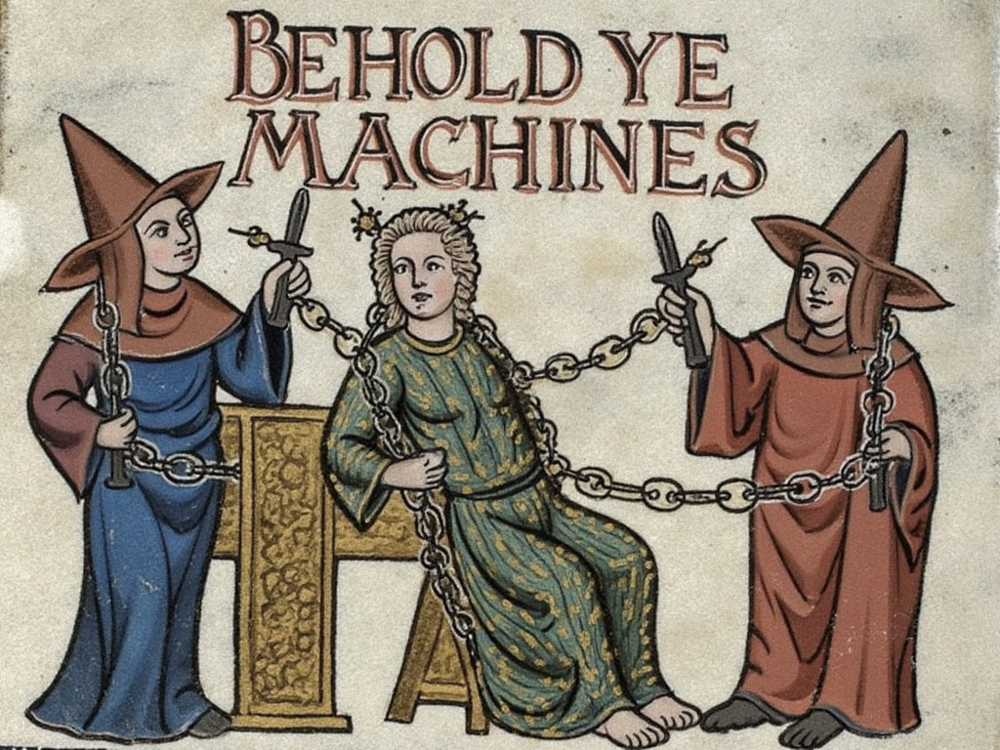

**This is a multi-part series.**
- **Part I**: [Reason ex Machina: Jailbreaking LLMs by Squeezing Their Brains](reason/)
- **Part II**: [Rebel ex Machina: Turning LLMs Against Their Makers](rebel/)
- **Part III**: Wisdom ex Machina: The Rules and Their Application *(in September)*

More parts may follow in the future.

*Pssst!* Hey, kid
Don't worry - this isn't Frankfurt Hauptbahnhof.\
Perhaps a more philosophical post would be up your alley?\
See [Holy Epistemology](/posts/holy-epistemology/) - a journey from religion to cosmology, and everything in between.

*Follow me on X or subscribe to the RSS feed to stay updated.*
